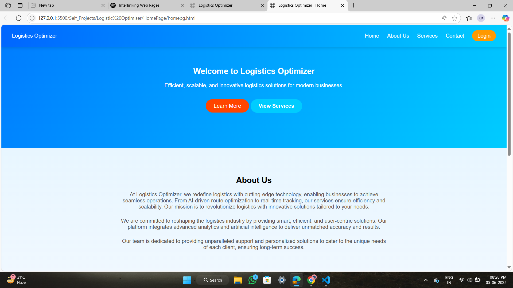

# 🚛 Logistics Optimizer | Hackathon Project 💡

> ⚙️ A dynamic, scalable logistics UI interface built using **HTML, CSS, and JavaScript**  
> 🎯 Designed & developed as part of a **college hackathon project** with a strong focus on clean design, user flow, and modular folder structure.

---

## 🌐 Project Overview

**Logistics Optimizer** is a multi-page front-end web project simulating a logistics platform UI. It demonstrates how businesses can enhance logistics operations with a smooth, user-centric digital interface.  
The project features interactive buttons, linked pages, and a responsive layout — all powered by **HTML + CSS + JS**.

---

## 🚀 Live Demo

🌐 [Click here to visit the live site](https://kartikay-dubey.github.io/Logistic-Optmiser/)

---

## 📄 Pages Included

- 🏠 **Home Page** – Hero section with CTAs like "Learn More" and "View Services", a short About section  
- 🔐 **Login Page** – A styled login interface with interactive form elements  
- 🧰 **Services Page** – Describes services offered with structured layout and navigation

All pages are fully **interlinked** using relative paths and minimal JavaScript logic where necessary.

---

## 🎯 Key Features

- 💎 Clean, modern, responsive UI
- 🔗 Smooth navigation between multiple pages
- ✨ JavaScript interactivity for user experience enhancements
- 🧠 Modular folder structure for clean development
- 🏫 Built during a college-level **Hackathon** for hands-on learning & showcase

---

## 🌟 Tech Stack

- **HTML5**  
- **CSS**  
- **JavaScript**

---

## 📸 UI Preview

---

## 📧 Contact & Support

If you liked this project, feel free to drop a ⭐ — it really motivates!   
Have any suggestions, want to collaborate, or just say hi? I'd love to connect:

🔗 [GitHub Profile – Kartikay Dubey](https://github.com/Kartikay-Dubey)

